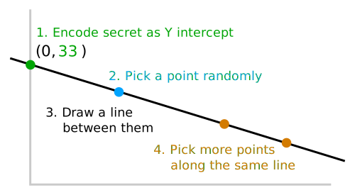

---
title: You could have invented Shamir's secret sharing
tags: cryptography, security, secret-sharing, math, python, horcrux
updated: 2021-09-25
...

Suppose you have some secret code---a master password or
cryptocurrency [seed phrase][seed] are common examples---and you want to back
it up. Is there a clever way to arrange things so that it's simultaneously
secure against the risk of you losing the backup and against the risk of
someone else finding it?

We'll try the naive way, build up to proper secret sharing, and finish with
recommendations for how you could actually use it to back up your passwords.
Some of this is based on [an excellent YouTube video][video], some on
[the original 1979 paper by Adi Shamir][paper], and the rest I came
up with myself.
 
# Attempt 1: break it in half

Most people would probably try breaking the secret code in half and storing the
two halves in separate locations. For example if you have the 8-character
password `!f8sy=06`, you could write `!f8s` on one piece of paper and `y=06` on
the other. There are two problems with that though:

#. If you lose either piece of paper you lose the password
#. If someone tech-savvy finds one piece, they might be able to guess the entire password
 
The first problem is obvious. You can see the second by using Python to
estimate the entropy of each piece:

~~~{ .python }
>>> import string
>>> chars = string.ascii_lowercase + string.ascii_uppercase + string.punctuation
>>> chars
'abcdefghijklmnopqrstuvwxyzABCDEFGHIJKLMNOPQRSTUVWXYZ!"#$%&\'()*+,-./:;<=>?@[\\]^_`{|}~'
>>> len(chars)
84
>>> len(chars) ** 8 # possible 8-char passwords
2406758911082496
>>> len(chars) ** 4 # possible 4-char password halves
49067136
~~~

There are only around 50 million combinations per half. Which sounds like a
lot, but a modern computer could probably try all of them in a couple seconds!
Another way to look at it is that guessing the missing half is 50 million times
easier than guessing the entire password from scratch.

# Attempt 2: add redundancy

Of course, you could compensate for that by making the password longer. But the
general problem remains, and it gets exponentially worse if you also try to
protect yourself against losing some of the pieces (problem #1 above).

Why the trade-off? Because to protect against losing any given part of the
password you have to make more than one copy of it. For example, you could
break the password into 3 partially redundant pieces so that any 2 of them can
be used to reconstruct it. But then each piece would have to contain more
of the password:

#. `███sy=06`
#. `!f8███06`
#. `!f8sy=██`

Now you're protected from losing any one share, but you've sacrificed almost
all of the entropy! Someone who finds even one piece can easily guess the
missing characters:

~~~{ .python }
>>> len(chars) ** 3 # possible missing 3-char chunks
592704
>>> len(chars) ** 2 # possible missing 2-char chunks
7056
~~~

If you needed to, you could pick a very long password and split it up like
that. But it turns out there's a more elegant way to solve both problems at
once...

# "One weird trick"

The trick is to encode your secret as the Y intercept of a curve, then write
down coordinates to points on that curve. Here's how to do the simplest "2 of
N" case, where the curve is a straight line and you can reconstruct it from any
2 points:

#. Encode secret as Y intercept
#. Pick a point randomly to be the first secret share
#. Draw a line between them
#. Pick more points along the same line to be the other shares

For step 1, there are many ways to encode text as numbers. We'll use
[ASCII character codes][ascii]:

~~~{ .python }
>>> def encode(chars):
...   return [ord(c) for c in chars]
...
>>> def decode(nums):
...   return ''.join(chr(n) for n in nums)
...
>>> encode('!f8sy=06')
[33, 102, 56, 115, 121, 61, 48, 54]
>>>
>>> decode(encode('!f8sy=06'))
'!f8sy=06'
~~~

To keep it simple, let's focus on secret sharing just the exclamation point:

Now anyone who has the `(x,y)` coordinates of at least two of the blue + brown
points can draw a line to find the secret number, 33. This is much better than
the naive solution above because finding one pair of coordinates leaks *no
information at all.* You could draw an infinite number of lines through the
point you found, and 128 of them would lead to Y intercepts representing ASCII
characters. Which is the same as the total number of characters you would have
to guess from anyway. Cool, right?

To split up the whole password we could just repeat that process 8 times.

# Generalize to other curves

Two points are enough to define a straight line. So if we want to require more
than 2 shares to reconstruct the secret, we need a more complicated curve. The
number of shares needed is called the "threshold". It's the same as the number
of variables (besides `x` and `y`) in the equation for the curve.

| Threshold | Equation                   | Curve     |
|:---------:|:--------------------------:|:---------:|
| 2         | $y = ax + b$               | linear    |
| 3         | $y = ax^2 + bx + c$        | quadratic |
| 4         | $y = ax^3 + bx^2 + cx + d$ | cubic     |
| ...       | ...                        | ...       |

For example, the cubic version (threshold = 4) could be set up like this:

It's probably counter-intuitive, but even knowing 3 of the blue + brown points
on that curve doesn't get you any closer to finding the intercept. Without 4
you might as well have none at all.

*Note: Shamir's actual scheme uses number fields defined in terms of large
prime numbers; the easier-to-visualize real number curves and equations
shown here are just meant to give some basic intuition for how the math works*

# Make it useful!

The final step is to hide the math from regular users who just want to back up
their cryptocurrency, passwords, or other data. The [`ssss` ("Shamir's Secret
Sharing Scheme") package][ssss] is easy to use. Pick the threshold with `-t` and
the total number of shares with `-n`:

~~~{ .txt }
$ ssss-split -t 3 -n 5
Generating shares using a (3,5) scheme with dynamic security level.
Enter the secret, at most 128 ASCII characters: !f8sy=06
Using a 64 bit security level.
1-d8a1c623c3a614a5
2-e38ae6524ad6f239
3-40676cf2da3882d3
4-36b7e761817c962b
5-955a6dc11192e6d3
~~~

~~~{ .txt }
$ ssss-combine -t 3 -n 5
Enter 3 shares separated by newlines:
Share [1/3]: 1-d8a1c623c3a614a5
Share [2/3]: 3-40676cf2da3882d3
Share [3/3]: 4-36b7e761817c962b
Resulting secret: !f8sy=06
~~~

Of course there's some other fanciness going on too. But I hope that it doesn't
look quite like magic anymore, and that you would consider using something
similar to back up your actual master password or seed phrase.

One warning though: don't use the online demo on the `ssss` site. You would be
sending your secrets to the author + anyone snooping on the unsecure HTTP
connection. Ideally you should boot into a Linux [LiveCD][livecd] (I like
[Lubuntu][lubuntu]), install it there with `sudo apt install ssss`, and only save
the secret shares on paper.

# Shameless self-promotion

If you do decide to use `ssss`, consider using it via [a program I wrote called
Horcrux][horcrux]. It's only a little more complicated. The main advantage is that
it lets you create your secret shares once, hide them, and then encrypt new
backups later without gathering enough shares to reconstruct the master password each
time. I think that makes it much more likely you'll keep regular backups, and
less likely you'll have the master password written on a Post-It note or in
some similarly insecure location.

[ascii]:   https://www.rapidtables.com/code/text/ascii-table.html
[horcrux]: https://github.com/jefdaj/horcrux
[livecd]:  https://en.wikipedia.org/wiki/Live_CD
[lubuntu]: https://lubuntu.net/downloads/
[paper]:   http://web.mit.edu/6.857/OldStuff/Fall03/ref/Shamir-HowToShareASecret.pdf
[seed]:    https://www.coinbase.com/learn/crypto-basics/what-is-a-seed-phrase
[ssss]:    http://point-at-infinity.org/ssss/
[video]:   https://www.youtube.com/watch?v=iFY5SyY3IMQ
