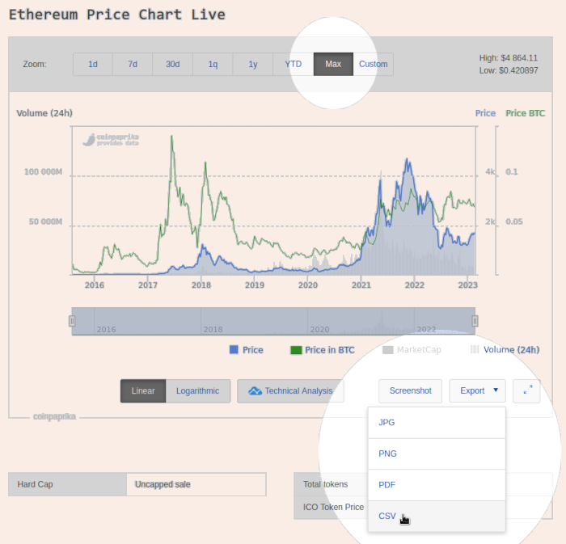
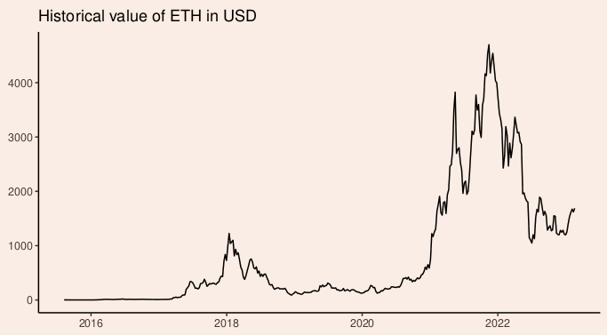

---
title: "Crypto Taxes the Hard Way: Historical Prices"
tags: hledger, haskell, taxes, accounting, ggplot, tidyverse
updated: 2023-02-25
...

*Disclaimer: nothing on this blog is advice about the substance of your taxes! I have no background in accounting and no idea whether this code will produce valid results. You need to verify everything yourself and then own your own mistakes or hire a tech-savvy [CPA][cpa] (or equivalent in your country) to go over it and fix any problems.*

Today we'll be adding historical crypto price data to [hledger][hl] and using it to track portfolio value.
It's also important for calculating taxes on staking income. I'll do a separate post on that.

[Here is a tarball][tar] of the code, or you can [read it on GitHub][gh].
The top-level files are one-off demos, but `import/coinpaprika` will slot into [the rest of the "full-fledged" system][ctthw] if you want it to.

# Export from CoinPaprika

I tried [CoinGecko][cghd] and [a Kaggle dataset][ccph] first, but settled on [CoinPaprika][cpp] because
they let you download the complete price history for many different coins/tokens conveniently.
No API account signup, no wasted time pasting paginated data into a spreadsheet!

The only downside is that it's low resolution weekly data rather than daily or hourly.
I think that should be OK for most purposes because whenever you buy or sell something that already has a real price; the historical data is only for estimating what you could have sold things for on different dates. And that's inherently a little vague because it would have depended on how and when you did it. So as long as you're not cherry picking the data in your favor I think any reasonable authority would be OK with it. *(Again: not tax advice. I don't know whether your authorities see it that way.)*

We'll use Ethereum as an example.
Go to [the coin page][eth], set the chart range to `Max`, and `Export → CSV`.
The link worked for me in Chromium but not Firefox.

The data should look like this:

~~~{ .txt }
"DateTime","Price","Price in BTC","Volume (24h)"
"2015-08-03 00:00:00",2.9379853153153,0.010536816026859,145781
"2015-08-10 00:00:00",1.4312609722222,0.0054110598511272,2518067
"2015-08-17 00:00:00",1.3534692708333,0.0057977101345057,1796680
...
"2023-01-30 00:00:00",1672.2780124628,0.07017126906523,8394707643
"2023-02-06 00:00:00",1620.9206133282,0.071827640577938,6702235129
"2023-02-13 00:00:00",1688.5364890397,0.068847315571221,7708162827
~~~

# Hack Hledger to import price feeds

I got `coinpaprika.rules` to generate almost-valid [market price directives][hmp] using empty transactions with just a `date` and `description`, then cleaned up the output in `csv2journal`.

~~~{ .ini }
# import/coinpaprika/coinpaprika.rules
skip 1
fields date,price,price_btc,volume_24h
date-format %Y-%m-%d %H:%M:%S
description ETH %price USD
~~~

~~~{ .bash }
# import/coinpaprika/csv2journal
hledger print --rules-file coinpaprika.rules -f "$1" | while read line; do
  [[ -z "$line" ]] || echo "P $line"
done
~~~

I'll do a post later that includes how to infer `ETH` from the filename rather than hard-coding it in the description.
Another minor improvement would be to do everything in `csv2journal` and skip the rules file, but I'll leave that as an exercise. The general philosophy is that hacks are fine as long as you version control them!

Let's try it.
This is roughly what `export/export.hs` in [the "full-fledged" system][ctthw] will do if you `include ./import/coinpaprika/journal/coinpaprika-ETH.journal` from one of the top-level journal files:

~~~{ .ini }
$ cd historical-prices
$ nix-shell
[nix-shell]$ cd import/coinpaprika
[nix-shell]$ chmod +x csv2journal
[nix-shell]$ mkdir journal
[nix-shell]$ ./csv2journal csv/coinpaprika-ETH.csv > journal/coinpaprika-ETH.journal
~~~

~~~{ .txt }
P 2015-08-03 2.9379853153153 USD
P 2015-08-10 1.4312609722222 USD
P 2015-08-17 1.3534692708333 USD
...
P 2023-01-30 1672.2780124628 USD
P 2023-02-06 1620.9206133282 USD
P 2023-02-13 1688.5364890397 USD
~~~

# Track portfolio value

We'll start a minimal `portfolio.journal` here for clarity.
You can do the same thing with `all.journal` later.
Here are the files we've used so far along with the new journal:

~~~{ .txt }
historical-prices
├── import
│   └── coinpaprika
│       ├── coinpaprika.rules
│       ├── csv2journal
│       ├── csv
│       │   └── coinpaprika-ETH.csv
│       └── journal
│           └── coinpaprika-ETH.journal
├── portfolio.journal
└── shell.nix
~~~

~~~{ .txt }
;; portfolio.journal

commodity 1000.00 USD
commodity 1000.00 ETH

2015-08-04 Buy 1 ETH back in the day
  assets:wallets:ancient 1 ETH
  equity:opening balances

include ./import/coinpaprika/journal/coinpaprika-ETH.journal
~~~

OK, so Hledger commands can be a little cryptic.
When trying something new I tend to look in [the manual][hlm], [this cheetsheet][hcs], and then forum posts if needed.
One nice feature is that order usually doesn't matter, so you can tack more flags on the end to incrementally improve it.

This command says "Using the file `portfolio.journal`, show the historical balances at the end of each year until today, converted to USD value, only for accounts with 'assets' in their names, and transpose the table". Whew!

~~~{ .ini }
[nix-shell]$ hledger -f portfolio.journal bal --historical -Y -e today -X USD assets --transpose
~~~

~~~{ .txt }
Ending balances (historical) in 2015-01-01..2023-12-31, valued at period ends:

            || assets:wallets:ancient |             
============++========================+=============
 2015-12-31 ||               0.95 USD |    0.95 USD 
 2016-12-31 ||               8.14 USD |    8.14 USD 
 2017-12-31 ||             728.19 USD |  728.19 USD 
 2018-12-31 ||             151.80 USD |  151.80 USD 
 2019-12-31 ||             129.39 USD |  129.39 USD 
 2020-12-31 ||             741.34 USD |  741.34 USD 
 2021-12-31 ||            3709.23 USD | 3709.23 USD 
 2022-12-31 ||            1197.17 USD | 1197.17 USD 
 2023-12-31 ||            1688.54 USD | 1688.54 USD 
~~~

# Plot portfolio value

Did you notice that today's `shell.nix` includes [tidyverse][tv]?
That's so that as a final sanity check we can increase the reporting frequency to weekly (`-W`) and plot USD value over time. Our 1 ETH "portfolio" should come out looking like the CoinPaprika chart at the top...

~~~{ .bash }
# save-portfolio-table.sh
echo 'date usd_value' > portfolio.tsv
hledger -f portfolio.journal bal --historical \
  assets -X USD -W -e today -X USD --transpose |
  grep '^\s*20' | awk '{print $1, $3}' \
  >> portfolio.tsv
~~~

~~~{ .R }
# plot-portfolio-table.R
require(tidyverse)
read_delim('portfolio.tsv') %>%
  ggplot(aes(x=date, y=usd_value)) +
    geom_line() +
    ggtitle('Historical value of ETH in USD') +
    xlab('') +
    ylab('') +
    theme_classic() +
    theme(aspect.ratio=1/2)
~~~

# What is it good for?

This might seem trivial because we got the same chart back at the end, but now we're close to a general solution! With a few more tweaks this can keep track of a real portfolio as we buy/sell/transfer things over time. In future posts I'll explain how to make portfolio value a report in [the "full-fledged" system][ctthw] and how to add more detailed charts by currency, location (bank/exchange/wallet), or accounting category (assets/liabilities/income/expenses).

[cpa]: https://www.investopedia.com/terms/c/cpa.asp
[hl]: https://hledger.org/
[ccph]: https://www.kaggle.com/datasets/sudalairajkumar/cryptocurrencypricehistory
[cghd]: https://www.coingecko.com/en/coins/bitcoin/historical_data
[cpp]: https://coinpaprika.com/
[eth]: https://coinpaprika.com/coin/eth-ethereum/
[hlm]: https://hledger.org/1.28/hledger.html
[hmp]: https://hledger.org/1.28/hledger.html#market-prices
[hcs]: https://devhints.io/hledger
[ctthw]: /posts/2023/02/18/crypto-taxes-the-hard-way
[tar]: historical-prices.tar
[tv]: https://www.tidyverse.org/
[gh]: https://github.com/jefdaj/cryptoisland/tree/master/src/posts/2023/02/23/crypto-taxes-the-hard-way-historical-prices/historical-prices
