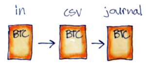
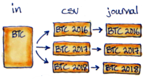

---
title: "Crypto Taxes the Hard Way: Split and Merge by Year"
tags: hledger, haskell, python, taxes, accounting
reminder: delta.png
...

<small>
*Disclaimer: nothing on this blog is advice about the substance of your taxes.* I have no background in accounting and no idea whether this code will produce valid results in your (or any!) tax situation.
</small>

When using [the "full-fledged hledger" system][ffhl] (see [my intro][intro]) it's helpful to separate all the imported data by tax year. You can do it manually in a spreadsheet editor, setting up your files like this...

...but copying/pasting rows is tedious and error-prone. Today I'll go over a couple functions I added to `export/export.hs` to automate it instead. Sorry in advance for the messy [Haskell][haskell]! I promise it enables a cleaner workflow.

# The "in → csv → journal" pattern

Parsing in the full-fledged system can have one or two steps depending on how weird the input data is. You always do the *second* step, `csv2journal`, which typically uses Hledger's CSV parsing DSL. But you can also add an `in2csv` script to do any extra cleanup and pre-processing that doesn't fit cleanly into that paradigm first.

I've found it useful to overload these two steps with splitting and merging respectively. There's no deep reason split/merge need to be coupled to `in2csv`/`csv2journal`; it just minimized the code changes and seems to work well in most cases.

# Avoid splitting by hand with `in2csv_splitYears`

## Haskell code

Add this to your `export/export.hs`, changing the input file patterns to match your importers.
The new code does the same thing as `in2csv` (the Haskell function), but also passes the year as a string when it calls scripts.

~~~{ .haskell }
import Data.List.Extra (splitOn)

-- ...

  -- This goes at the end of the export_all function,
  -- below the equivalent list for regular in2csv:
  [ "//import/coinpaprika/csv/*.csv",
    "//import/etherscan/csv/*.csv" ] |%> in2csv_splitYears

-- ...

-- Based on in2csv, but passes a multi-year file + a year arg to the in2csv script.
-- Requires the out file to be named with "-<year>" at the end, for example "mywallet-2023.csv"
in2csv_splitYears out = do
  let (cdir, file) = splitFileName out
      (base, ext)  = splitExtension file
      year         = last $ splitOn "-" base
      file_noyear  = (concat $ intersperse "-" $ init $ splitOn "-" base) ++ ext
      pdir         = parentOf   "csv"      cdir
      idir         = replaceDir "csv" "in" cdir
      script       = "in2csv_splitYears"
  possibleInputs <- getDirectoryFiles idir [file_noyear -<.> "*"]
  let inputs =
        case possibleInputs of
          [] -> error $ "no inputs for " ++ show file_noyear
          _ -> map (idir</>) $ possibleInputs ++ (extraInputs file_noyear)
  let deps = map (pdir </>) $ extraDeps out
  need $ (pdir </> script):(inputs ++ deps)
  (Stdout output) <- cmd (Cwd pdir) Shell ("./" ++ script) (year: map (makeRelative pdir) inputs)
  writeFileChanged out output
~~~

## Python script

Now in each import folder you have the option of keeping your current `in2csv` script,
or renaming it `in2csv_splitYears` and handling an extra argument for the year.
All you have to do is filter out lines not matching that year.
I do it with variations on this template Python script.

~~~{ .python }
#!/usr/bin/env python3

from sys import argv, stdout
from csv import DictReader, DictWriter

def match_year(row):
    '''Returns whether to edit + print this row
    '''
    # TODO adjust this to your input format
    date_field = 'Date'
    return row[date_field].startswith(year):

def edit_row(row):
    '''Make any edits you want to the row dict here
    For example:
    - add an account field based on the filename
    - remove commas from numbers
    - combine send amount + fee into a total
    '''
    return row

def main(year, in_file):
    '''Read in_file, keep rows matching year, edit them, print csv
    '''
    with open(in_file, 'r', encoding='utf-8-sig') as f:
        reader = DictReader(f)
        writer = None # wait to make it below
        for row in reader:
            if not match_year(row):
                continue
            row = edit_row(row)
            if writer is None:
                # get header from first row
                header = row.keys()
                writer = DictWriter(stdout, fieldnames=header)
                writer.writeheader()
            writer.writerow(row)

if __name__ == '__main__':
    year    = argv[1]
    in_file = argv[2]
    main(year, in_file)
~~~

Most of that is a good template for an `in2csv` script too. Just remove the `year` and `match_year` parts.

# Avoid including split files by hand with `csv2journal_mergeYears`

Once you have a CSV per input per year, you can use this to merge journal files by year.
Note that the code assumes you're also using `in2csv_splitYears` from above. It will get confused and fail if you manually split up the CSV files and skip the `in2csv` step, even though that sounds equivalent.

## Haskell code

~~~{ .haskell }
-- ...

  -- This goes at the end of the export_all function,
  -- below the equivalent list for regular csv2journal:
  [ "//import/coinpaprika/journal/*.journal",
    "//import/etherscan/journal/*.journal" ] |%> csv2journal_mergeYears

-- ...

-- Based on csv2journal, but merges all the input files for a given year.
-- Name your script csv2journal_mergeYears to use this version.
csv2journal_mergeYears out = do
  let (jdir, file) = splitFileName out
      (base, ext)  = splitExtension file
      year         = last $ splitOn "-" base
      pdir         = parentOf   "journal" jdir
      cdir         = replaceDir "journal" "csv" jdir
      idir         = replaceDir "journal" "in"  jdir
      script       = "csv2journal_mergeYears"
  csvs <- (fmap . map)
            (\f -> cdir </> (fst $ splitExtension f) ++ "-" ++ year ++ ".csv")
            (getDirectoryFiles idir ["*"])
  let deps = map (pdir </>) $ extraDeps out
  need $ (pdir </> script):(csvs++deps)
  (Stdout output) <- cmd (Cwd pdir) Shell ("./" ++ script) $ map (makeRelative pdir) csvs
  writeFileChanged out output
~~~

## Shell script

I normally don't bother with Python for this part because it's short.
When you name the script `csv2journal_mergeYears` it will get a list of CSV files instead of a single file. Use `hledger` to parse them sequentially.

~~~{ .bash }
#!/usr/bin/env bash
for csv in $@; do
  hledger print --rules-file myimporter.rules -f $csv
done
~~~

The transactions will be out of order, but the full-fledged system automatically fixes that later.

## Journal files

The last step is to consolidate your `include` statements.
Here's an example of how your [CoinPaprika price feeds][cpf] might change. The deduplication is nice, but more importantly now you can't forget one of them!

~~~{ .diff }
-include ./import/coinpaprika/journal/BTC-2023.journal
-include ./import/coinpaprika/journal/ETH-2023.journal
-include ./import/coinpaprika/journal/BNB-2023.journal
-include ./import/coinpaprika/journal/XRP-2023.journal
-include ./import/coinpaprika/journal/ADA-2023.journal
-include ./import/coinpaprika/journal/OKB-2023.journal
-include ./import/coinpaprika/journal/MATIC-2023.journal
-include ./import/coinpaprika/journal/DOGE-2023.journal
+include ./import/coinpaprika/journal/2023.journal
~~~

The same trick also works with other data sources like bank accounts and wallets. For example if you have many different ETH wallets each carrying a different ERC20 token, you could include all of them in one line per year too. (I'll do a post soon on importing [EtherScan][es] data)

~~~{ .diff }
-include ./import/etherscan/journal/ethwallet-2023.journal
-include ./import/etherscan/journal/linkwallet-2023.journal
-include ./import/etherscan/journal/maticwallet-2023.journal
-include ./import/etherscan/journal/shibwallet-2023.journal
+include ./import/etherscan/journal/2023.journal
~~~

# Add it to your repo

As always, [here is a tarball][tar] of today's code.

~~~{ .txt }
split-and-merge-by-year
├── export
│   └── export.hs
└── import
    └── myimporter
        ├── csv2journal_mergeYears
        └── in2csv_splitYears
~~~

This time it's *not* a complete runnable example though. Just an outline. I assume if you're interested in this it means you're starting your own full-fledged repo. So go ahead and check out a temporary branch to try the split/merge thing on your own data!

[ffhl]: https://github.com/adept/full-fledged-hledger
[intro]: /posts/2023/02/18/crypto-taxes-the-hard-way
[cpf]: /posts/2023/02/23/crypto-taxes-the-hard-way-historical-prices
[es]: https://etherscan.io/
[haskell]: https://www.haskell.org/
[tar]: split-and-merge-by-year.tar
