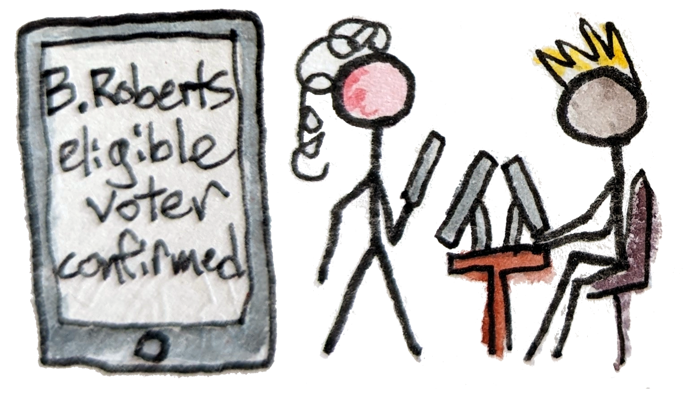
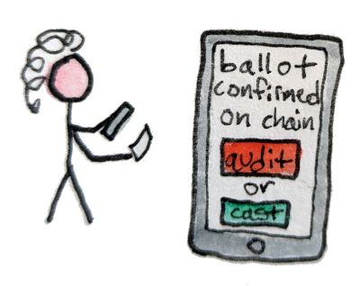
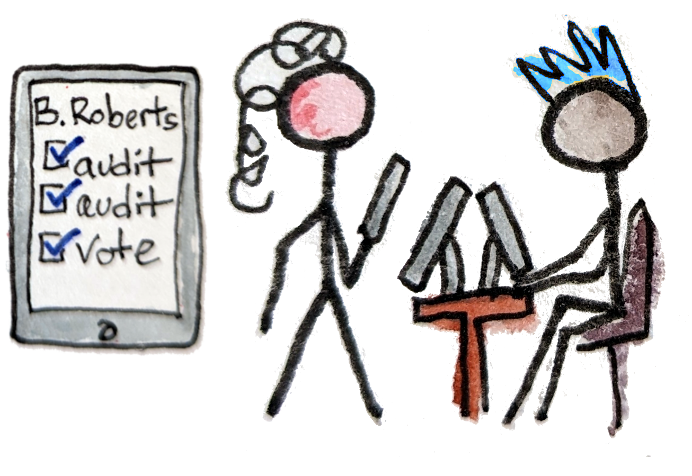

---
title: "Gamified blockchain voting from a voter's perspective"
tags: electionguard, blockchain, voting, utxo, cardano
toc: True
reminder: election-day.png
...

[eg-site]: https://www.electionguard.vote

When you picture the voting system of the future, it's probably on your phone. Right?
Unfortunately, although *blockchain* voting can be done securely today, *internet* voting is much harder.
So I'll sketch out an in-person system using a hypothetical blockchain-enabled version of [ElectionGuard][eg-site].

It's a little different than the polling place experience you're used to,
but all the required tech exists.
From a voter's perspective, the main changes are:

* an app + QR codes
* the "Benaloh challenge"
* NFT gamification
* live dashboards

Of those, only the Benaloh challenge is a core part of the ElectionGuard system.
The rest are interesting ideas that may or may not turn out to be worth adding.
_The ElectionGuard authors haven't reviewed or endorsed this!
Whether to do blockchain voting and whether to do it this way are separate questions._

OK, with that out of they, you're an average voter in the not-so-distant future...

# ID check & voting NFT

</img>

You arrive at your local polling place and see there are three lines: one to check in, one to vote, and one to check out (mint your NFTs).
Simple enough. A screen on the wall monitors the blockchain and displays the number of voters currently voting at each polling place, along with percent of eligible voters who have already finished.

More interestingly it also shows the number of audits done (56,000) and alleged irregularities so far (25),
along with the total fraud bounty.

While waiting in the first line you download an update to your preferred voting app.
You trust this one because it's open source, audited, and endorsed by the state + your political party.
You also trust that the developers are interested in catching any funny business so they can get their share of the fraud bounty,
and in not damaging their reputation by missing something.

At the front of the line you hand your ID to a poll worker.
They check it against the state database, which confirms you're a registered voter who hasn't already voted in this election.
They mint a vote-in-progress NFT and send it to the wallet in your app. The number on the wall increments and you head for the voting line.

# Voting (no phones allowed)

</img>

You flip through the official paper voter's guide, and also browse one published by a local news website on your phone. You haven't finished deciding how to vote when you get to the front of the line, but that's OK. You know this first time through won't be your real vote anyway.

You leave your phone in a lock box and step into a voting booth.
You randomly tap out some choices on the touchscreen, making sure to wait a few seconds each time so it plausibly seems like you're thinking. Then you hit "submit", take your printed QR code, and get back to your phone.

# Audit or cast?

Now the "fun" part: the Benaloh challenge. You actually think of it as a chore, but you do it anyway because you want the "I audited!" NFT, worth \$10 off groceries. The app scans the QR code, confirms that your vote is on chain, and presents the choice: audit or cast? You choose audit. It signs a transaction to that effect and adds it to the chain. A few seconds later, the voting machine responds by publishing the decryption key. You  check that your (public, invalidated) ballot looks as expected. Sadly, it does---no fraud bounty today. You get back in the voting line for another round.

</img>

You can audit as many times as you want, since it's important for the voting machine not to know when you'll cast your final vote. You're already bored, but the line is very short and you could use more free groceries. You do one more quick audit, using the extra time in line to finish picking your actual votes.

OK, for real now. The third time you fill the ballot out correctly and cast it. This also burns your vote-in-progress NFT. The voting machine responds by promising that it has destroyed the temporary decryption key. There's no way to check that it encrypted your vote honestly, but you expect that it did because it couldn't have known whether you would choose to audit again.

# Mint personal NFTs

</img>

The last line moves quickly. Another poll worker traces the history of your vote-in-progress NFT and sends one "I voted!" + 2 "I audited!" NFTs to your personal wallet. \$20 off groceries. They thank you for voting.

Besides groceries, the NFTs will also validate your parking, and prove to your boss that you were out for an approved reason today.
If you ever need to prove that you passed a state ID check, they'll work for that too.

# Verify the results

Nothing left to do now except get groceries and watch the election play out on TV, or on one of the many dashboard websites. (The commentary varies, but at least they all agree on the numbers.)

Actually, you *could* verify the entire election yourself and post a proof of correctness to the blockchain relatively easily. But you don't bother. Only the first 100 done with each verifier implementation are eligible for "I verified" NFTs, up to 1000 total. And you know how people are---they've got their collateral ready and will post verifications seconds after the official tally is uploaded, just for the bragging rights.
Instead you cook dinner while the deadlines come and go, and watch the confirmations pour in.

You won't find out what happened with the ~50 total alleged irregularities for a couple days. But you aren't concerned because none of them were self proving (fraudulent messages signed by a voting machine), and there aren't nearly enough to swing the election anyway.

# Vibe check

So that's the general workflow from an imaginary average voter's perspective. What's your reaction?

Personally, I would be annoyed with the gamification! It feels somehow undignified. But on reflection I would appreciate that incentives are necessary to get people to confirm that every aspect of the election is legit. There's still the choice not to vote, or to vote but not to bother with NFTs, same as before.

More importantly, I think that skeptical--even conspiratorially minded--voters, with no unusual math skills, could be convinced that their votes were counted honestly using this sort of system. Rather than antagonizing them by saying they should trust authority it acknowledges that their fears are reasonable, hires them to investigate, and then definitively passes all the tests. That's a huge improvement over the status quo.

Maybe things will feel different in the future? But I'm posting this 3 weeks before the 2024 US presidential election, and today everyone I know would gladly put up with some NFT bullshit if they thought it would raise the odds of a peaceful transfer of power.

# Time to build

There might be issues with the particular incentives imagined here, but IMO the major stumbling block is clearly the requirement for in-person voting. I hope we'll be able to tackle that soon.

In the meantime, let's get going on the version we know we can build! We don't need any new cryptography first; at this point the most urgent research questions are around engineering, usability, incentives, and public education. And those are probably best answered via lots of small pilot studies.
