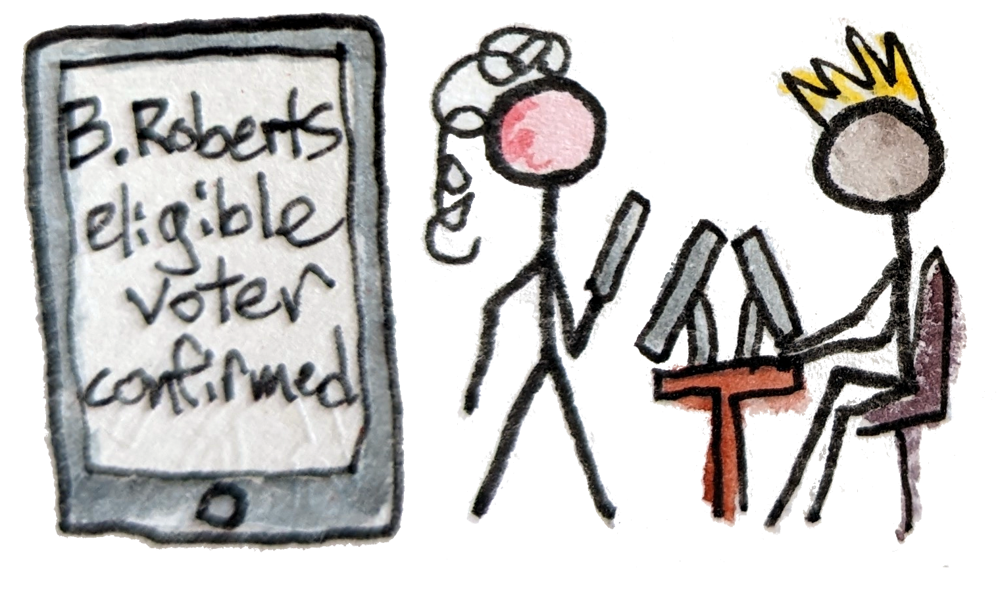
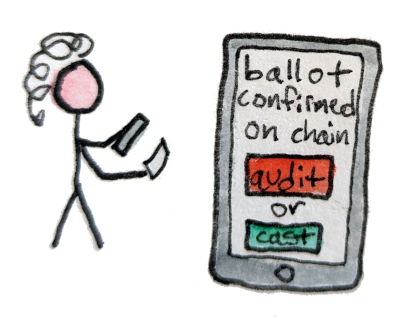
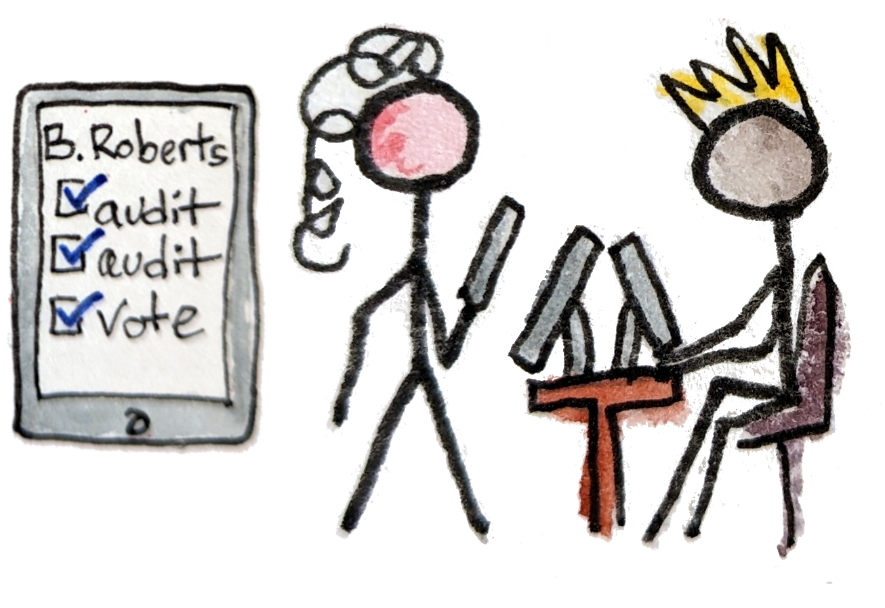

---
title: What could blockchain voting look like?
tags: electionguard, blockchain, voting, utxo, cardano
toc: True
reminder: election-day.png
...

[eg-site]: https://electionguard.vote
[cardano]: https://cardano.org

When you picture the voting workflow of the future, it's probably on your phone. Right?
Unfortunately, although *blockchain* voting can be done securely today, *internet* voting is much harder.
So I'll sketch out a less ambitious in-person workflow using a hypothetical blockchain-enabled version of [ElectionGuard][eg-site].
Phones are still involved, but they won't be allowed into the voting booth.
You might notice the [Cardano][cardano]-style NFTs, but the basic ideas should generalize to any blockchain.

So, what would it look like from the voter's perspective? Here's one possiblity...

_This is my own idea, and might need revision.
The ElectionGuard authors haven't reviewed or endorsed it._

# ID check & voting NFT

</img>

You arrive at your local polling place and see there are three lines: one to check in, one to vote, and one to check out.
Simple enough. A screen on the wall monitors the blockchain and displays the number of voters currently voting at each polling place, along with percent of eligible voters who have already finished.

More interestingly, it also shows the number of audits done (500,000) and irregularities proven (0) so far,
along with the accumulated fraud bounty (\$100 million).
You download the latest update for your preferred voting app while waiting in the first line.
You trust this app because it's open source, audited, and endorsed by the state + your political party.
You also trust that the developers are interested in catching any funny business so they can get their share of the fraud bounty,
and in not damaging their reputation by missing something.

At the front of the line you hand your ID to the poll worker.
They check it against a state database, which confirms you're a registered voter who hasn't already voted in this election.
Then they mint a voting-in-progress NFT and send it to the wallet in your app. The number on the wall increments and you head for the voting line.

# Voting booth (no phone allowed)

</img>

You flip through the official (paper) voter's guide, and also one published one by a local news site on your phone. You circle a couple choices. You haven't finished when you get to the front of the line, but that's OK. You know this first time through won't be your real vote anyway.

When it's your turn you lock your phone in a lock box and step into a voting booth.
You randomly tap out some choices on the touchscreen, making sure to wait a few seconds each time so it plausibly seems like you're making a real choice. Then you hit "submit", take your printed QR code, and go get your phone back.

# Audit or cast?

Now the "fun" part: the Benaloh challenge. You actually think of it as a chore, but you do it because you want the "I audited!" NFT, worth \$5 off groceries. The app scans the QR code, confirms that your vote is on chain, and presents the choice: audit or cast? You choose audit. It signs a transaction to that effect and adds it to the chain. A few seconds later, the voting machine responds by publishing the decryption key. You  check that your (public, invalidated) ballot looks as expected. Sadly, it does---no fraud bounty today.

</img>

You can audit as many times as you want, since it's important for the voting machine not to know when you'll cast your final vote. But you're already bored, and each time you have to wait a little longer in line. So you stick with one.

OK, for real now. You get back in line, finish circling your choices in the booklet, go back into the booth, and fill them in on the machine. This time you choose "cast" after scanning the QR code. It burns your vote-in-progress NFT. The voting machine responds by promising on chain that it has also destroyed the ballot decryption key. You won't know whether the real vote was encrypted honestly, but you expect that it was because the machine couldn't have known whether you would choose to audit again.

# Mint personal NFTs

</img>

The last line moves quickly. Another poll worker traces the history of your vote-in-progress NFT and sends the proper "I voted!" + "I audited!" NFTs to your personal wallet. They thank you for voting.

Besides getting you \$5 off groceries they'll also validate your parking, and prove to your boss that you were out for an approved reason today.
Finally, they'll help if you ever need to prove that you passed an ID check.

# Verify final tally

Nothing left to do now except get groceries and watch the progress of the election on TV, or on one of the many dashboard websites run by private observers.

Actually, you could verify the entire election yourself and post a proof of correctness to the blockchain relatively easily. But you don't bother. Only the first 100 done with each verifier implementation are eligible for "I verified" NFTs, up to 1000 total. And you know how people are---they'll post them seconds after the official tally is uploaded, just for the bragging rights.

# Vibe check

So that's the general workflow from an imagined voter's perspective. What's your reaction?

Personally, I would be annoyed with the gamification at first. But on reflection I would appreciate that it's necessary to get people to personally check every aspect of the election. I would still have the choice not to vote, or to vote but not bother with the NFTs. So it seems like a reasonable trade-off.

I would also accept a lot of annoyance in return for increased confidence in the system.
I think even very skeptical--perhaps conspiratorially inclined--voters, with no special math skills, could be convinced that their votes were counted honestly using a scheme like this. That's a huge improvement over the status quo!

# Conclusion

There might be issues with the particular incentives imagined here, but IMO the major stumbling block is clearly the requirement for in-person voting. I hope we'll be able to tackle that someday soon.

In the meantime though, let's get going on the version we know we can build! We don't need to invent any more cryptography first; at this point the most urgent research questions are around engineering, usability, and public education. And those are probably best answered by doing lots of small pilot studies.
