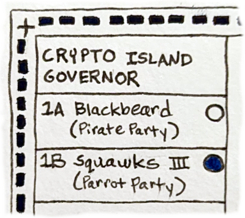
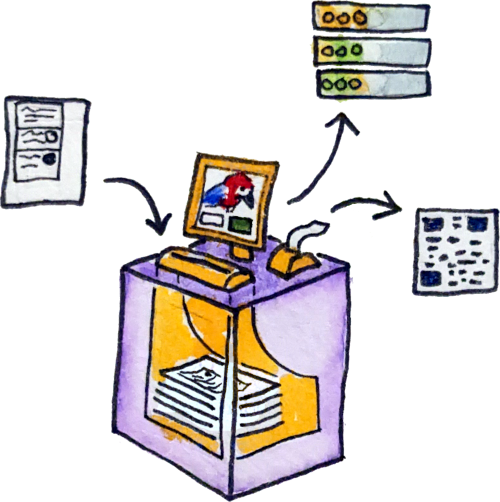

---
title: Mechanics of the Benaloh Challenge
tags: electionguard, blockchain, voting, incentives, brainstorm
reminder: boring-card-trick.png
...

_Warning: work in progress. Posted early so I can link here from the Catalyst idea._

# Current mechanics

</img>

## Fill out a paper ballot

This can be done in any traditional way:

* fill it out by hand
* select options on a touchscreen and have the machine print it
* listen to audio instructions
* have a human help fill it out if needed
* ...

</img>

The important thing is that you end up with a paper ballot at the end.

## Submit ballot

The machine scans your ballot and keeps it. Keeping it is important, both for audits and to prevent you from showing someone how you voted later. You might optionally get a chance to confirm on screen that everything was scanned correctly.

This is simple from the voter's perspective, but it's the submission/scanning machine is where a lot of the ElectionGuard magic happens.
It reads the ballot, converts it to a vector of (mostly) zeros and ones,
and encrypts it. To prevent all the encrypted ballots with the same choices looking the same,

Finally, the encrypted ballot is uploaded to the "public bulletin board" (normally a website run by the election administrator).

</img>

## Take confirmation code

The submission/scanner machine then prints a receipt that includes the hash of the final encrypted ballot. 
Later, the voter can check that a ballot with that hash was included in the final tally.

## Audit or cast?

I believe this is sometimes at the same submission/scanning machine, and sometimes at a separate station.
If done at a separate station, though, the stations need to be networked together, because if you choose to audit then the machine needs to publish the random number it used during encryption.

Perhaps the main advantage of a separate station is that a human can explain the choice, and then either direct you out of the voting area or back into line depending whether you audit?

## Confirm tally and audit decryption

Later, after the final tally is published, the voter checks on the bulletin board website that:

#. Their final cast ballot was included in the tally
#. Their audited ballots, if any, were decrypted as expected

## Dispute audited ballot encryptions?

I'm not sure if there's any standard process for disputing an audit result in the current workflow.
I imagine, though, that any such challenge would be resolved by finding the original paper ballot and hand counting it under independent observation.

# Proposed blockchain upgrades

In the workflow I'm imagining, the first few steps would stay roughly the same:

1. Show ID at the check-in counter
2. Fill out a paper ballot (possibly using a machine) in a voting booth
3. Submit the ballot, and get a confirmation code (hash of the posted cyphertext)

The only difference is that in my system you would get a "vote in progress" NFT after the ID check.

## Cast & audit via phone app

The system I'm proposing is that you take your receipt after submitting the paper ballot, then instead of going to a "challenge station" or finishing that on the same scan/submit machine, you scan the QR code and finish the process on your own phone---or laptop, I suppose.

(I know, people these days want to shoehorn everything into being an app, and I normally hate that!
But in this case there are some major advantages.)

Now the voter now has a trusted device that can do cryptographic operations on their behalf, which means:

1. We can add a second step to the Benaloh challenge where we immediately decrypt audited ballots, and either certify or dispute the result.
2. We can broadcast each step in the protocol on chain, and watch everyone doing it in real time.

It looks a little more complicated, but not too bad:

<!-- TODO put labels at bottom of subgraphs? -->

</img>

`S:` means something is being posted on chain by the "system", and `V:` means something is posted on chain by the voter's trusted app.

## Self-certify casts & audits

Rather than communicating with the voting system locally via touchscreen or a poll worker, the choice to audit or cast should be publicly announced on chain. You control your own phone app and the blockchain is independent, so there's no plausible way for the voting system to interfere with your choice or know about it in advance.

## Immediate decryption of audited ballots

One advantage of doing the challenge via phone app is that it can immediately download the encrypted ballot from the bulletin board website and/or blockchain. If the voting machine also publishes the nonce (random number) used to encrypt, the app can use that to "brute force" all possible ballot selections until it finds the one that matches the ciphertext. That way, you can confirm that the encrypted choices look right. You should then have the additional choice to publicly certify that they do, or publicly launch a dispute (have someone look at the paper ballot).

## Live statistics

All these self certifications on chain add up to vastly improved real-time data, which can be published fast enough to head off any misinformation about the election. In my opinion that's the real secret sauce! Reliable, immediate proof that there's no large scale fraud that could plausibly be changing the results of the election.

As Dr Benaloh says, "the statistics are on our side": TODO CITE, TODO explain stats?

The odds of a hack or deception being able to swing an election decrease dramatically as people audit ballots.
Because this is such an impressive effect, I think we should make it more obvious!
I think the cleanest way to do that is via live dashboards.

# Misc

## Privacy Preserved

It's important to note that you would *not* be linking your identity to the ballot on chain. That could be dangerous if your vote is selected for decryption during a risk limiting audit.

Instead, I'm proposing that the voting app generate a new wallet/address per vote. After you show your ID at the check-in counter, the poll worker would send a "vote in progress" NFT to the wallet authorizing it to vote.

That's why in my version you have to revisit the check-in station each time you vote: you're getting a new NFT.
On chain, everyone sees a series of anonymous-but-authorized NFTs going through the voting steps.
They're created by the poll worker and burned by the voter during `cast`, `certify`, and `dispute` actions.

## Dispute collateral

<!-- TODO a simulation game where you try to cheat would also be a really good idea! -->
<!-- TODO could also promote actual red teaming via hacker events, but not sure about that -->

