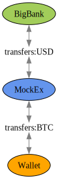
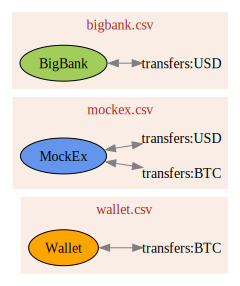

---
title: "Crypto Taxes the Hard Way: Transfer Accounts"
tags: taxes, hledger, accounting, crypto, tradfi
reminder: transfers.png
...

[hl]: https://hledger.org/
[intro]: /posts/2023/02/18/crypto-taxes-the-hard-way

<small>
*Disclaimer: nothing on this blog is advice about the substance of your taxes.* I have no background in accounting and no idea whether this code will produce valid results in your (or any!) tax situation.
</small>

<!-- TODO quick check that there isn't already a good guide on this stuff! if so just link to it -->

Transfer accounts are relatively standard accounting trick that I took a while to figure out.
You should learn them straight away though! It'll save a lot of time when using
[Hledger][hl] or plain text accounting generally, and they're especially useful for [crypto taxes][intro].

# The easy way

Suppose you have accounts with BigBank and MockEx, along with a Bitcoin wallet, and you're in the USA.
Here's a diagram of the accounts, transfers, and currencies you probably need to track:

</img>

The easiest way to represent it in hledger is probably to parse all the transfers from the MockEx data
and ignore them in the BigBank + Wallet data, like this:

~~~{ .txt }
# mockex.rules

# One account is always the main one for the current file
account1 assets:mockex

# The other account and currency can be decided by regex matches
if (Incoming|Outgoing).*USD
  account2 assets:bigbank
  currency USD
if (Withdrawal|Deposit).*BTC
  account2 assets:wallet
  currency BTC
~~~

~~~{ .txt }
# bigbank.rules
# Regex to match the bank's descriptions
if TRANSFER (TO|FROM) MOCKEX
  skip
~~~

~~~{ .txt }
# wallet.rules
# Regex to match your own annotations
# (Alternatively, can use individual TXIDs)
if mockex
  skip
~~~

<!--
Ignoring them sounds like it would be a problem, but you can still check that all the accounts add up in hledger:
-->

<!-- TODO example -->

If this is your only way of trading crypto, you might even be able to finish
your taxes without parsing the bank or wallet data at all!

# The elegant, sustainable way

Sadly, the easy way doesn't scale.
As you add accounts it'll become harder to remember which transfers should be parsed and which should be ignored.
At some point, you should really add transfer accounts:

</img>

Each transfer will now be recorded as two halves: into the transfer account, and back out (not necessarily in that order).
For the cost of adding a few extra hledger accounts,
we get a graph that can be neatly decomposed to match the data files.

</img>

Now we can parse all the transfers from each source and dump them into the main journal,
and they should all balance.

~~~{ .txt }
# bigbank.rules
currency USD
account1 assets:bigbank
if TRANSFER (TO|FROM) MOCKEX
  account2 transfers:USD
~~~

~~~{ .txt }
# mockex.rules
account1 assets:mockex
if (Incoming|Outgoing).*USD
  account2 transfers:USD
  currency USD
if (Withdrawal|Deposit).*BTC
  account2 transfers:BTC
  currency BTC
~~~

~~~{ .txt }
# wallet.rules
currency BTC
account1 assets:wallet
if mockex
  account2 transfers:BTC
~~~

This isn't only an ergonomic improvement.
It also makes it much easier to double check that the amounts reported by each institution match up.
(You might be surprised---or not---to learn that several large US exchanges do weird rounding errors in their own favor.)
By checking that the transfer accounts zero out periodically, we can catch various errors.

Speaking of which, it would also be reasonable to call these "error" accounts rather than "transfers",
because their accumulated balances track imbalances in your accounting.
That might be more appealing if you already have an `error` account for other reasons.

<!-- TODO example? -->

<!--
It can be annoying to have to account for all the edge cases,
but IMO the confidence of knowing everything balances is worth the hassle.
-->

# Handling many accounts

What if you have more than one bank account, or more than one wallet?
<b>This will handle it automatically with no additional work!</b>

<!-- TODO move this part to the tradfi post: -->

It also handles multiple accounts within the same bank.
For example if you have checking, credit, and savings/money market accounts you can just
regex match on whatever description the accounts use for incoming and outgoing transfers,
and call them all `transfers:USD`.

~~~{ .txt }
# bigbank-checking.rules

currency USD

# Other accounts will be the same except this line
account1 assets:bigbank:checking

# ... unless they also need different regexes
if ^TRANSFER.*
  account2 transfers:USD

# (The credit accounts might also have their + and -
# signs flipped, but that's out of scope for today.)
~~~

<!-- TODO example -->

# Handling many currencies

Only a little bit of additional work this time. Suppose you have an Ethereum
wallet, and it transacts in multiple currencies: moving ERC20 tokens, paying
fees in ETH, getting airdrops or spam, etc. Technically you could send them all
via the same `transfers:ETH` account, but I find it easier to make one per
token. That way I don't have to remember that `transfers:ETH` can contain
other currencies, which used to trip me up a lot. Either way is fine though.

Here's what a transfer might look like in this style after parsing a csv from
each of your wallets and dumping them both into the main journal:

~~~{ .txt }
2025-11-01 wallet1 send LINK
  assets:wallet1  -10.000 LINK
  assets:wallet1   -0.001 ETH
  expenses:fees     0.001 ETH
  transfers:LINK   10.000 LINK

2025-11-01 wallet2 receive LINK
  assets:wallet2   10.000 LINK
  transfers:LINK  -10.000 LINK
~~~

<!-- TODO find one of your transfers with actual gas price -->

The last pro tip for today is that if you name your transfer accounts based on
tickers (`LINK` rather than `chainlink`), you can generate them as needed in
your rules files.
