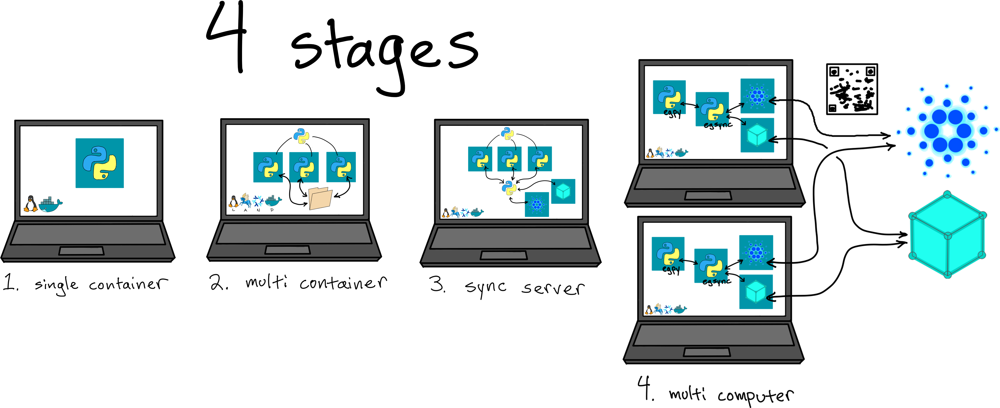
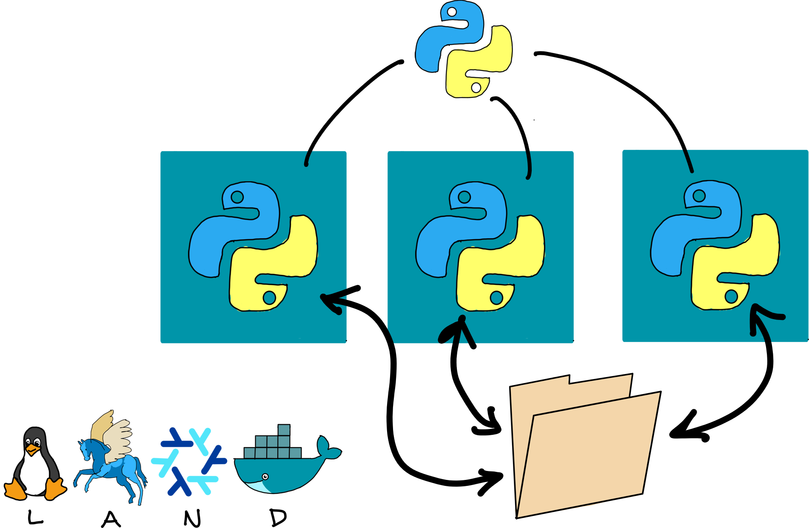

---
title: "ElectionGuard + Cardano Dev Update #1: Election Demo"
tags: electionguard, cardano, catalyst, fund13, elections, nix, python, docker, arion, linux, dev-update
reminder: pineapple.png
...

[cast]: https://asciinema.org/a/lloCjFW2LvnqdqKEbQGdySsRC
[code]: https://github.com/jefdaj/electionguard-cardano/tree/trunk/milestone1/election
[egc]:  https://github.com/jefdaj/electionguard-cardano
[egpy]: https://github.com/jefdaj/electionguard-python
[eljs]: https://github.com/jefdaj/electionguard-cardano/tree/trunk/milestone1/election/election.json
[elpy]: https://github.com/jefdaj/electionguard-cardano/tree/trunk/milestone1/election/election.py
[f13]:  https://milestones.projectcatalyst.io/projects/1300090
[next]: /posts/2025/12/23/egc-dev02-election-verifier
[yt]:   https://www.youtube.com/watch?v=wQx7ZbuKT7o


Today's code runs an ElectionGuard election locally using a set of Docker containers.
It comes with a companion [YouTube video][yt] and [Asciinema demo][cast].

Since this is the first update, here are some other project resources too:

* [jefdaj/electionguard-cardano][code] is the main codebase
* [jefdaj/electionguard-python][egpy] is my fork of the EG reference implementation
* [The Catalyst project page][f13]

<!--
TODO include a few "why"s:
- why docker containers instead of nix only?
- why arion instead of docker-compose?
- why the json file arion/python thing?
-->


# Architecture

This is my rough plan for building out the demo:



Stage 1 is a Docker container packaging the reference implementation, which [I did already][egpy].

Today's demo is the first part of stage 2.
It's a top-level Python script controlling a set of Docker containers.
[election.py][elpy] reads [election.json][eljs],
spins up the containers using Arion,
and runs `docker exec` commands telling them what to do at each step:



The containers each have a private state in `data/private/<container name>`, and they communicate only via a shared `data/public` folder. For now we'll just pretend it enforces the rules of a blockchain: files in there are timestamped, immutable, and digitally signed by the wallet of the party that added them. In milestone 2 (confusingly referred to as stage 3 in the diagram above) I'll work on publishing these files over Cardano + IPFS.

I chose to set it up with Docker containers this way rather than my initial thought (pure Nix) for three main reasons:

1. It'll make adding other components like Cardano, IPFS, Ogmios, Kupo easier
2. It'll make the system easier to set up for technical users who want to host their own elections
3. The reference implementation depends on very specific library versions that I had trouble satisfying using anything other than Ubuntu or Debian from around the time it was published.

# The Pineapple Referendum

This is a minimal ballot for testing purposes with only one question.
The options in the reference implementation were "yes" and "no",
but I added an "unsure" option to check that I understand how to change them.
(It's a bit of a hack and involves making each answer a "candidate".)

[election.json][eljs] scripts the number of votes for each option,
so we can check at the end that the decrypted tally matches.

```json
{
  "arion": {
    "project_name": "election",
    "bind_mounts": {
      "scripts": "/scripts",
      "public": "/data/public",
      "private": "/data/private"
    }
  },
  "election": {
    "guardians": {"count": 3, "quorum": 2},
    "devices": {"count": 4},
    "question": "Should pineapple be banned on pizza?"
  },
  "votes": {
    "Yes":    {"cast": 1, "spoil":3},
    "No":     {"cast": 2, "spoil":2},
    "Unsure": {"cast": 3, "spoil":1}
  }
}
```

Assuming you have Docker and Nix installed,
and Nix flakes enabled, you can run the referendum.

```bash
cd electionguard-cardano/milestone1/election
nix develop
./election.py
```

When it asks for your password, that's only to delete `./data` and possibly to enable Docker commands.
Then it should run a bunch of `docker exec` commands, like this:

```txt
### setup ###

/nix/store/0hnya01zxwfsnd30l8lb9aiqqg2in27a-docker-compose.yaml
 Network election  Creating
 Network election  Created
 Container election-guardian1-1  Creating
 ...
 Container election-guardian1-1  Started

### build_manifest ###

docker exec election-admin1-1 poetry run /scripts/admin.py build-manifest --public-dir /data/public --referendum-question Should pineapple be banned on pizza?

### announce_key_ceremony ###

docker exec election-admin1-1 poetry run /scripts/admin.py announce-key-ceremony --public-dir /data/public --guardian-count 3 --guardian-quorum 2

### key_ceremony_round1 ###

docker exec election-guardian1-1 poetry run /scripts/guardian.py key-ceremony --public-dir /data/public --private-dir /data/private --ceremony-round 1 --guardian-id guardian_1 --guardian-sequence-order 1

docker exec election-guardian2-1 poetry run /scripts/guardian.py key-ceremony --public-dir /data/public --private-dir /data/private --ceremony-round 1 --guardian-id guardian_2 --guardian-sequence-order 2

docker exec election-guardian3-1 poetry run /scripts/guardian.py key-ceremony --public-dir /data/public --private-dir /data/private --ceremony-round 1 --guardian-id guardian_3 --guardian-sequence-order 3

### key_ceremony_round2 ###

docker exec election-guardian1-1 poetry run /scripts/guardian.py key-ceremony --public-dir /data/public --private-dir /data/private --ceremony-round 2 --guardian-id guardian_1 --guardian-sequence-order 1

docker exec election-guardian2-1 poetry run /scripts/guardian.py key-ceremony --public-dir /data/public --private-dir /data/private --ceremony-round 2 --guardian-id guardian_2 --guardian-sequence-order 2

docker exec election-guardian3-1 poetry run /scripts/guardian.py key-ceremony --public-dir /data/public --private-dir /data/private --ceremony-round 2 --guardian-id guardian_3 --guardian-sequence-order 3

### key_ceremony_round3 ###

docker exec election-guardian1-1 poetry run /scripts/guardian.py key-ceremony --public-dir /data/public --private-dir /data/private --ceremony-round 3 --guardian-id guardian_1 --guardian-sequence-order 1

docker exec election-guardian2-1 poetry run /scripts/guardian.py key-ceremony --public-dir /data/public --private-dir /data/private --ceremony-round 3 --guardian-id guardian_2 --guardian-sequence-order 2

docker exec election-guardian3-1 poetry run /scripts/guardian.py key-ceremony --public-dir /data/public --private-dir /data/private --ceremony-round 3 --guardian-id guardian_3 --guardian-sequence-order 3

### publish_joint_key ###

docker exec election-admin1-1 poetry run /scripts/admin.py publish-joint-key --public-dir /data/public

### build_election ###

docker exec election-admin1-1 poetry run /scripts/admin.py build-election --public-dir /data/public

### add_devices ###

docker exec election-device1-1 poetry run /scripts/device.py add-device --public-dir /data/public --device-number 1

docker exec election-device2-1 poetry run /scripts/device.py add-device --public-dir /data/public --device-number 2

docker exec election-device3-1 poetry run /scripts/device.py add-device --public-dir /data/public --device-number 3

docker exec election-device4-1 poetry run /scripts/device.py add-device --public-dir /data/public --device-number 4

### vote_all ###

docker exec election-device1-1 poetry run /scripts/device.py vote --public-dir /data/public --private-dir /data/private --device-number 1 --candidate Yes --spoil True

docker exec election-device2-1 poetry run /scripts/device.py vote --public-dir /data/public --private-dir /data/private --device-number 2 --candidate Yes --spoil True

docker exec election-device3-1 poetry run /scripts/device.py vote --public-dir /data/public --private-dir /data/private --device-number 3 --candidate Yes --spoil True

docker exec election-device4-1 poetry run /scripts/device.py vote --public-dir /data/public --private-dir /data/private --device-number 4 --candidate Yes --spoil False

docker exec election-device1-1 poetry run /scripts/device.py vote --public-dir /data/public --private-dir /data/private --device-number 1 --candidate No --spoil True

docker exec election-device2-1 poetry run /scripts/device.py vote --public-dir /data/public --private-dir /data/private --device-number 2 --candidate No --spoil True

docker exec election-device3-1 poetry run /scripts/device.py vote --public-dir /data/public --private-dir /data/private --device-number 3 --candidate No --spoil False

docker exec election-device4-1 poetry run /scripts/device.py vote --public-dir /data/public --private-dir /data/private --device-number 4 --candidate No --spoil False

docker exec election-device1-1 poetry run /scripts/device.py vote --public-dir /data/public --private-dir /data/private --device-number 1 --candidate Unsure --spoil True

docker exec election-device2-1 poetry run /scripts/device.py vote --public-dir /data/public --private-dir /data/private --device-number 2 --candidate Unsure --spoil False

docker exec election-device3-1 poetry run /scripts/device.py vote --public-dir /data/public --private-dir /data/private --device-number 3 --candidate Unsure --spoil False

docker exec election-device4-1 poetry run /scripts/device.py vote --public-dir /data/public --private-dir /data/private --device-number 4 --candidate Unsure --spoil False

### tally ###

docker exec election-admin1-1 poetry run /scripts/admin.py tally --public-dir /data/public

### decrypt_shares ###

docker exec election-guardian1-1 poetry run /scripts/guardian.py decrypt-shares --public-dir /data/public --private-dir /data/private --guardian-id guardian_1

computed guardian_1 decryption share of election tally
computed guardian_1 decryption share of ballot-f512d9a0-e023-11f0-8c36-ce89c2e804da
computed guardian_1 decryption share of ballot-f38097b2-e023-11f0-bd15-faf5e3d58ded
computed guardian_1 decryption share of ballot-f595f4d4-e023-11f0-aea1-faf5e3d58ded
computed guardian_1 decryption share of ballot-f2f71be0-e023-11f0-8779-ce89c2e804da
computed guardian_1 decryption share of ballot-f408e6e4-e023-11f0-ba1e-2eb40f2ca782
computed guardian_1 decryption share of ballot-f71c771a-e023-11f0-8c68-ce89c2e804da

docker exec election-guardian2-1 poetry run /scripts/guardian.py decrypt-shares --public-dir /data/public --private-dir /data/private --guardian-id guardian_2

computed guardian_2 decryption share of election tally
computed guardian_2 decryption share of ballot-f512d9a0-e023-11f0-8c36-ce89c2e804da
computed guardian_2 decryption share of ballot-f38097b2-e023-11f0-bd15-faf5e3d58ded
computed guardian_2 decryption share of ballot-f595f4d4-e023-11f0-aea1-faf5e3d58ded
computed guardian_2 decryption share of ballot-f2f71be0-e023-11f0-8779-ce89c2e804da
computed guardian_2 decryption share of ballot-f408e6e4-e023-11f0-ba1e-2eb40f2ca782
computed guardian_2 decryption share of ballot-f71c771a-e023-11f0-8c68-ce89c2e804da

docker exec election-guardian3-1 poetry run /scripts/guardian.py decrypt-shares --public-dir /data/public --private-dir /data/private --guardian-id guardian_3

computed guardian_3 decryption share of election tally
computed guardian_3 decryption share of ballot-f512d9a0-e023-11f0-8c36-ce89c2e804da
computed guardian_3 decryption share of ballot-f38097b2-e023-11f0-bd15-faf5e3d58ded
computed guardian_3 decryption share of ballot-f595f4d4-e023-11f0-aea1-faf5e3d58ded
computed guardian_3 decryption share of ballot-f2f71be0-e023-11f0-8779-ce89c2e804da
computed guardian_3 decryption share of ballot-f408e6e4-e023-11f0-ba1e-2eb40f2ca782
computed guardian_3 decryption share of ballot-f71c771a-e023-11f0-8c68-ce89c2e804da

### decrypt_results ###

docker exec election-admin1-1 poetry run /scripts/admin.py decrypt-results --public-dir /data/public

decrypted tally
decrypted ballot-f512d9a0-e023-11f0-8c36-ce89c2e804da
decrypted ballot-f38097b2-e023-11f0-bd15-faf5e3d58ded
decrypted ballot-f595f4d4-e023-11f0-aea1-faf5e3d58ded
decrypted ballot-f2f71be0-e023-11f0-8779-ce89c2e804da
decrypted ballot-f408e6e4-e023-11f0-ba1e-2eb40f2ca782
decrypted ballot-f71c771a-e023-11f0-8c68-ce89c2e804da

### summary ###

docker exec election-admin1-1 poetry run /scripts/admin.py summary --public-dir /data/public

----------------------------------------
Individual spoiled ballots
----------------------------------------

f512d9a0-e023-11f0-8c36-ce89c2e804da
  Should pineapple be banned on pizza? No

f38097b2-e023-11f0-bd15-faf5e3d58ded
  Should pineapple be banned on pizza? Yes

f595f4d4-e023-11f0-aea1-faf5e3d58ded
  Should pineapple be banned on pizza? No

f2f71be0-e023-11f0-8779-ce89c2e804da
  Should pineapple be banned on pizza? Yes

f408e6e4-e023-11f0-ba1e-2eb40f2ca782
  Should pineapple be banned on pizza? Yes

f71c771a-e023-11f0-8c68-ce89c2e804da
  Should pineapple be banned on pizza? Unsure


----------------------------------------
Tally of all cast ballots
----------------------------------------

Should pineapple be banned on pizza?
  Unsure: 3
  No: 2
  Yes: 1

### teardown ###

 Container election-device3-1  Stopping
 Container election-guardian3-1  Stopping
 ...
 Container election-guardian2-1  Removed
 Network election  Removing
 Network election  Removed
```

We'll go into detail about what's going on at each stage in the protocol in future updates.
For now, just try editing [election.json][eljs] and re-running it to convince yourself
that the vote totals in `data/public/3_results/3_summary.json` always match.
They should look something like this.

```json
{
  "Tally of all cast ballots": [
    {
      "question": "Should pineapple be banned on pizza?",
      "votes": {
        "Unsure": 3,
        "No": 2,
        "Yes": 1
      }
    }
  ],
  ...
}
```

In [dev update #2][next] I'll show how independent observers can verify the public files.

# Dev options

When hacking on `election.py`, it might be helpful to run one step in the election protocol at a time:

```bash
nix develop
./election.py --single-step setup
./election.py --single-step build_manifest
./election.py --single-step ...
./election.py --single-step teardown
```

There's also a `--pause-to-explain` option, which I wrote for the video but also use to inspect the generated files as it runs.

```bash
nix develop
./election.py --pause-to-explain
```

