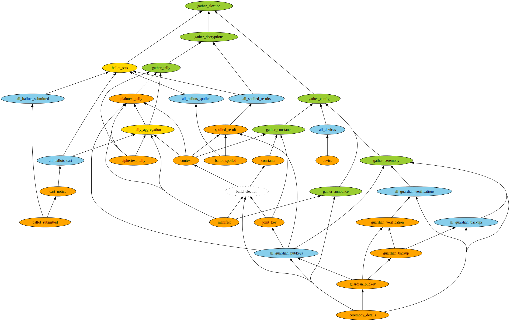

---
title: "ElectionGuard + Cardano Dev Update #2: Election Verifier"
tags: electionguard, cardano, catalyst, fund13, elections, nix, python, docker, arion, linux, dev-update
reminder: deps-small.png
...

[code]: https://github.com/jefdaj/electionguard-cardano/tree/trunk/milestone1/verifier
[egpy]: https://github.com/jefdaj/electionguard-python
[elpy]: https://github.com/jefdaj/electionguard-cardano/tree/trunk/milestone1/election/election.py
[f13]:  https://milestones.projectcatalyst.io/projects/1300090
[next]: /posts/2025/12/23/egc-dev03-election-tests
[prev]: /posts/2025/12/23/egc-dev01-election-demo
[yt]:   https://www.youtube.com/watch?v=MtkSXy5WDUQ

This is dev update #2 for [my fund13 project][f13].
You can find the code [here][code], and a companion YouTube video [here][yt].

In [the last update][prev] I packaged the [ElectionGuard Python reference implementation][egpy] into a Docker container and ran an election using multiple instances of it communicating via a shared folder. Today I want to show how to verify the artifacts in that folder.

# What I did

I'm not a cryptographer, so I didn't attempt to verify or rewrite any of the low level crypto code in the reference implementation here. This was more about rearranging it to be:

- a little more comprehensive
- clearer to read
- compatible with my data file format
- less monolithic and easier to run incrementally during an election

# Official election artifacts

Files generated during a typical election look like this.
You can create them by running the code in [the first dev update][prev].

```txt
data/
├── private
│   ├── admin_1
│   ├── device_1
│   │   └── plaintext_ballots
│   │       ├── ballot-f2f71be0-e023-11f0-8779-ce89c2e804da.json
│   │       ├── ballot-f512d9a0-e023-11f0-8c36-ce89c2e804da.json
│   │       └── ballot-f71c771a-e023-11f0-8c68-ce89c2e804da.json
│   ├── device_2
│   │   └── plaintext_ballots
│   │       ├── ballot-f38097b2-e023-11f0-bd15-faf5e3d58ded.json
│   │       ├── ballot-f595f4d4-e023-11f0-aea1-faf5e3d58ded.json
│   │       └── ballot-f79e812e-e023-11f0-920c-faf5e3d58ded.json
│   ├── device_3
│   │   └── plaintext_ballots
│   │       ├── ballot-f408e6e4-e023-11f0-ba1e-2eb40f2ca782.json
│   │       ├── ballot-f616747e-e023-11f0-b569-2eb40f2ca782.json
│   │       └── ballot-f82655ae-e023-11f0-bb16-2eb40f2ca782.json
│   ├── device_4
│   │   └── plaintext_ballots
│   │       ├── ballot-f48c8210-e023-11f0-9bda-66b350748407.json
│   │       ├── ballot-f69b75b6-e023-11f0-a295-66b350748407.json
│   │       └── ballot-f8a750f0-e023-11f0-b410-66b350748407.json
│   ├── guardian_1
│   │   └── election_key_pair.json
│   ├── guardian_2
│   │   └── election_key_pair.json
│   └── guardian_3
│       └── election_key_pair.json
└── public
    ├── 1_config
    │   ├── 1_announce
    │   │   ├── 1_manifest.json
    │   │   └── 2_ceremony.json
    │   ├── 2_ceremony
    │   │   ├── 1_pubkeys
    │   │   │   ├── guardian_1.json
    │   │   │   ├── guardian_2.json
    │   │   │   └── guardian_3.json
    │   │   ├── 2_backups
    │   │   │   ├── guardian_1_backup_2.json
    │   │   │   ├── guardian_1_backup_3.json
    │   │   │   ├── guardian_2_backup_1.json
    │   │   │   ├── guardian_2_backup_3.json
    │   │   │   ├── guardian_3_backup_1.json
    │   │   │   └── guardian_3_backup_2.json
    │   │   └── 3_verifications
    │   │       ├── guardian_1_backup_2.json
    │   │       ├── guardian_1_backup_3.json
    │   │       ├── guardian_2_backup_1.json
    │   │       ├── guardian_2_backup_3.json
    │   │       ├── guardian_3_backup_1.json
    │   │       └── guardian_3_backup_2.json
    │   ├── 3_election
    │   │   ├── constants.json
    │   │   ├── context.json
    │   │   └── joint_key.json
    │   └── 4_devices
    │       ├── device_1.json
    │       ├── device_2.json
    │       ├── device_3.json
    │       └── device_4.json
    ├── 2_ballots
    │   ├── 1_submitted
    │   │   ├── ballot-f2f71be0-e023-11f0-8779-ce89c2e804da.json
    │   │   ├── ballot-f38097b2-e023-11f0-bd15-faf5e3d58ded.json
    │   │   ├── ballot-f408e6e4-e023-11f0-ba1e-2eb40f2ca782.json
    │   │   ├── ballot-f48c8210-e023-11f0-9bda-66b350748407.json
    │   │   ├── ballot-f512d9a0-e023-11f0-8c36-ce89c2e804da.json
    │   │   ├── ballot-f595f4d4-e023-11f0-aea1-faf5e3d58ded.json
    │   │   ├── ballot-f616747e-e023-11f0-b569-2eb40f2ca782.json
    │   │   ├── ballot-f69b75b6-e023-11f0-a295-66b350748407.json
    │   │   ├── ballot-f71c771a-e023-11f0-8c68-ce89c2e804da.json
    │   │   ├── ballot-f79e812e-e023-11f0-920c-faf5e3d58ded.json
    │   │   ├── ballot-f82655ae-e023-11f0-bb16-2eb40f2ca782.json
    │   │   └── ballot-f8a750f0-e023-11f0-b410-66b350748407.json
    │   ├── 2_cast
    │   │   ├── ballot-f48c8210-e023-11f0-9bda-66b350748407.json
    │   │   ├── ballot-f616747e-e023-11f0-b569-2eb40f2ca782.json
    │   │   ├── ballot-f69b75b6-e023-11f0-a295-66b350748407.json
    │   │   ├── ballot-f79e812e-e023-11f0-920c-faf5e3d58ded.json
    │   │   ├── ballot-f82655ae-e023-11f0-bb16-2eb40f2ca782.json
    │   │   └── ballot-f8a750f0-e023-11f0-b410-66b350748407.json
    │   └── 3_spoiled
    │       ├── ballot-f2f71be0-e023-11f0-8779-ce89c2e804da.json
    │       ├── ballot-f38097b2-e023-11f0-bd15-faf5e3d58ded.json
    │       ├── ballot-f408e6e4-e023-11f0-ba1e-2eb40f2ca782.json
    │       ├── ballot-f512d9a0-e023-11f0-8c36-ce89c2e804da.json
    │       ├── ballot-f595f4d4-e023-11f0-aea1-faf5e3d58ded.json
    │       └── ballot-f71c771a-e023-11f0-8c68-ce89c2e804da.json
    └── 3_results
        ├── 1_tally.json
        ├── 2_decrypt
        │   ├── 1_shares
        │   │   ├── 1_tally
        │   │   │   ├── tally_guardian_1.json
        │   │   │   ├── tally_guardian_2.json
        │   │   │   └── tally_guardian_3.json
        │   │   └── 2_spoiled
        │   │       ├── ballot-f2f71be0-e023-11f0-8779-ce89c2e804da_guardian_1.json
        │   │       ├── ballot-f2f71be0-e023-11f0-8779-ce89c2e804da_guardian_2.json
        │   │       ├── ballot-f2f71be0-e023-11f0-8779-ce89c2e804da_guardian_3.json
        │   │       ├── ballot-f38097b2-e023-11f0-bd15-faf5e3d58ded_guardian_1.json
        │   │       ├── ballot-f38097b2-e023-11f0-bd15-faf5e3d58ded_guardian_2.json
        │   │       ├── ballot-f38097b2-e023-11f0-bd15-faf5e3d58ded_guardian_3.json
        │   │       ├── ballot-f408e6e4-e023-11f0-ba1e-2eb40f2ca782_guardian_1.json
        │   │       ├── ballot-f408e6e4-e023-11f0-ba1e-2eb40f2ca782_guardian_2.json
        │   │       ├── ballot-f408e6e4-e023-11f0-ba1e-2eb40f2ca782_guardian_3.json
        │   │       ├── ballot-f512d9a0-e023-11f0-8c36-ce89c2e804da_guardian_1.json
        │   │       ├── ballot-f512d9a0-e023-11f0-8c36-ce89c2e804da_guardian_2.json
        │   │       ├── ballot-f512d9a0-e023-11f0-8c36-ce89c2e804da_guardian_3.json
        │   │       ├── ballot-f595f4d4-e023-11f0-aea1-faf5e3d58ded_guardian_1.json
        │   │       ├── ballot-f595f4d4-e023-11f0-aea1-faf5e3d58ded_guardian_2.json
        │   │       ├── ballot-f595f4d4-e023-11f0-aea1-faf5e3d58ded_guardian_3.json
        │   │       ├── ballot-f71c771a-e023-11f0-8c68-ce89c2e804da_guardian_1.json
        │   │       ├── ballot-f71c771a-e023-11f0-8c68-ce89c2e804da_guardian_2.json
        │   │       └── ballot-f71c771a-e023-11f0-8c68-ce89c2e804da_guardian_3.json
        │   └── 2_combined
        │       ├── 1_tally.json
        │       └── 2_spoiled
        │           ├── ballot-f2f71be0-e023-11f0-8779-ce89c2e804da.json
        │           ├── ballot-f38097b2-e023-11f0-bd15-faf5e3d58ded.json
        │           ├── ballot-f408e6e4-e023-11f0-ba1e-2eb40f2ca782.json
        │           ├── ballot-f512d9a0-e023-11f0-8c36-ce89c2e804da.json
        │           ├── ballot-f595f4d4-e023-11f0-aea1-faf5e3d58ded.json
        │           └── ballot-f71c771a-e023-11f0-8c68-ce89c2e804da.json
        └── 3_summary.json

34 directories, 93 files
```

In milestone 2 I plan to post everything under `data/public` to Cardano + IPFS.

Later, in a real election, I hope these files will be published by election officials in close to real time (allowing for optional delays to post batches of ballots for improved voter privacy). There will be an indexer app (developed in milestone 2 + 3) to allow any interested observer to keep their local copy in sync as an election progresses. 

_Side note: the plaintext ballots should *not* be kept by actual ElectionGuard voting machines.
In a future hypothetical version of the protocol with staking, I might even favor having them post a signed message saying they've securely deleted each cast ballot so that they can be slashed if anyone can produce the plaintext._

The artifacts come with a summary of the results:

```json
{
  "Tally of all cast ballots": [
    {
      "question": "Should pineapple be banned on pizza?",
      "votes": {
        "Unsure": 3,
        "No": 2,
        "Yes": 1
      }
    }
  ],
  "Individual spoiled ballots": {
    "f512d9a0-e023-11f0-8c36-ce89c2e804da": [
      {
        "Should pineapple be banned on pizza?": "No"
      }
    ],
    "f38097b2-e023-11f0-bd15-faf5e3d58ded": [
      {
        "Should pineapple be banned on pizza?": "Yes"
      }
    ],
    "f595f4d4-e023-11f0-aea1-faf5e3d58ded": [
      {
        "Should pineapple be banned on pizza?": "No"
      }
    ],
    "f2f71be0-e023-11f0-8779-ce89c2e804da": [
      {
        "Should pineapple be banned on pizza?": "Yes"
      }
    ],
    "f408e6e4-e023-11f0-ba1e-2eb40f2ca782": [
      {
        "Should pineapple be banned on pizza?": "Yes"
      }
    ],
    "f71c771a-e023-11f0-8c68-ce89c2e804da": [
      {
        "Should pineapple be banned on pizza?": "Unsure"
      }
    ]
  }
}
```

But, can we really trust the election officials to report that honestly?


# Don't trust, verify!

Any interested observer will be able to run one of hopefully many independently developed and audited verifiers to double check that the ElectionGuard protocol is being followed correctly, and (in later versions) to post certifications or disputes on chain.

Today's code is a first draft of one possible verifier. Here's how you can try it.

```bash
$ cd electionguard-cardano/milestone1/verifier
$ nix develop
$ ./verifier.py

/nix/store/wy5s1xijg5v4m1y26gk25vzz1xzd5m60-docker-compose.yaml
 Container verifier-verifier1-1  Starting
 Container verifier-verifier1-1  Started
docker exec verifier-verifier1-1 poetry run /scripts/verifier.py verify --public-dir /data/public --verifier-id verifier1 --logfile /data/public/verify.log

 Container verifier-verifier1-1  Stopping
 Container verifier-verifier1-1  Stopped
 Container verifier-verifier1-1  Removing
 Container verifier-verifier1-1  Removed
 Network verifier  Removing
 Network verifier  Removed
```

The terminal output isn't very interesting; the files we want to look at are:

* `data/public/verify.log` (a temporary location for the human-readable log)
* `data/public/4_verify/verifier1.json` (the part that will go on chain)

## Human-readable Log

```txt
Verifying announcement:
✅ manifest
✅ ceremony_details

Verifying key ceremony:
✅ guardian_pubkey {'guardian_id': 'guardian_1'}
✅ guardian_pubkey {'guardian_id': 'guardian_2'}
✅ guardian_pubkey {'guardian_id': 'guardian_3'}
✅ guardian_backup {'guardian_id': 'guardian_1', 'backup_order': 2}
✅ guardian_backup {'guardian_id': 'guardian_1', 'backup_order': 3}
✅ guardian_backup {'guardian_id': 'guardian_2', 'backup_order': 1}
✅ guardian_backup {'guardian_id': 'guardian_2', 'backup_order': 3}
✅ guardian_backup {'guardian_id': 'guardian_3', 'backup_order': 1}
✅ guardian_backup {'guardian_id': 'guardian_3', 'backup_order': 2}
✅ guardian_verification {'guardian_id': 'guardian_1', 'backup_order': 2}
✅ guardian_verification {'guardian_id': 'guardian_1', 'backup_order': 3}
✅ guardian_verification {'guardian_id': 'guardian_2', 'backup_order': 1}
✅ guardian_verification {'guardian_id': 'guardian_2', 'backup_order': 3}
✅ guardian_verification {'guardian_id': 'guardian_3', 'backup_order': 1}
✅ guardian_verification {'guardian_id': 'guardian_3', 'backup_order': 2}

Verifying election constants:
✅ joint_key
✅ constants
✅ internal_manifest
✅ context

Verifying 4 encryption devices:
✅ device {'device_number': 1}
✅ device {'device_number': 2}
✅ device {'device_number': 3}
✅ device {'device_number': 4}

Verifying 12 submitted ballots:
✅ ballot_submitted {'ballot_id': 'ballot-f8a750f0-e023-11f0-b410-66b350748407'}
✅ ballot_submitted {'ballot_id': 'ballot-f48c8210-e023-11f0-9bda-66b350748407'}
✅ ballot_submitted {'ballot_id': 'ballot-f82655ae-e023-11f0-bb16-2eb40f2ca782'}
✅ ballot_submitted {'ballot_id': 'ballot-f512d9a0-e023-11f0-8c36-ce89c2e804da'}
✅ ballot_submitted {'ballot_id': 'ballot-f79e812e-e023-11f0-920c-faf5e3d58ded'}
✅ ballot_submitted {'ballot_id': 'ballot-f38097b2-e023-11f0-bd15-faf5e3d58ded'}
✅ ballot_submitted {'ballot_id': 'ballot-f616747e-e023-11f0-b569-2eb40f2ca782'}
✅ ballot_submitted {'ballot_id': 'ballot-f595f4d4-e023-11f0-aea1-faf5e3d58ded'}
✅ ballot_submitted {'ballot_id': 'ballot-f69b75b6-e023-11f0-a295-66b350748407'}
✅ ballot_submitted {'ballot_id': 'ballot-f2f71be0-e023-11f0-8779-ce89c2e804da'}
✅ ballot_submitted {'ballot_id': 'ballot-f408e6e4-e023-11f0-ba1e-2eb40f2ca782'}
✅ ballot_submitted {'ballot_id': 'ballot-f71c771a-e023-11f0-8c68-ce89c2e804da'}

Verifying 6 cast ballots:
✅ cast_notice {'ballot_id': 'ballot-f8a750f0-e023-11f0-b410-66b350748407'}
✅ cast_notice {'ballot_id': 'ballot-f48c8210-e023-11f0-9bda-66b350748407'}
✅ cast_notice {'ballot_id': 'ballot-f82655ae-e023-11f0-bb16-2eb40f2ca782'}
✅ cast_notice {'ballot_id': 'ballot-f79e812e-e023-11f0-920c-faf5e3d58ded'}
✅ cast_notice {'ballot_id': 'ballot-f616747e-e023-11f0-b569-2eb40f2ca782'}
✅ cast_notice {'ballot_id': 'ballot-f69b75b6-e023-11f0-a295-66b350748407'}

Verifying 6 spoiled ballots:
✅ ballot_spoiled {'ballot_id': 'ballot-f512d9a0-e023-11f0-8c36-ce89c2e804da'}
✅ ballot_spoiled {'ballot_id': 'ballot-f38097b2-e023-11f0-bd15-faf5e3d58ded'}
✅ ballot_spoiled {'ballot_id': 'ballot-f595f4d4-e023-11f0-aea1-faf5e3d58ded'}
✅ ballot_spoiled {'ballot_id': 'ballot-f2f71be0-e023-11f0-8779-ce89c2e804da'}
✅ ballot_spoiled {'ballot_id': 'ballot-f408e6e4-e023-11f0-ba1e-2eb40f2ca782'}
✅ ballot_spoiled {'ballot_id': 'ballot-f71c771a-e023-11f0-8c68-ce89c2e804da'}

Verifying 6 spoiled ballot decyptions:
✅ spoiled_result {'ballot_id': 'ballot-f512d9a0-e023-11f0-8c36-ce89c2e804da'}
✅ spoiled_result {'ballot_id': 'ballot-f38097b2-e023-11f0-bd15-faf5e3d58ded'}
✅ spoiled_result {'ballot_id': 'ballot-f595f4d4-e023-11f0-aea1-faf5e3d58ded'}
✅ spoiled_result {'ballot_id': 'ballot-f2f71be0-e023-11f0-8779-ce89c2e804da'}
✅ spoiled_result {'ballot_id': 'ballot-f408e6e4-e023-11f0-ba1e-2eb40f2ca782'}
✅ spoiled_result {'ballot_id': 'ballot-f71c771a-e023-11f0-8c68-ce89c2e804da'}

Verifying ballot ID sets:
✅ 6 ballots spoiled = 6 ballots decrypted
✅ 6 ballots cast + 6 ballots spoiled = 12 ballots submitted
✅ set(spoiled ballot IDs) = set(decrypted ballot IDs)
✅ set(cast ballot IDs) + set(spoiled ballot IDs) = set(submitted ballot IDs)

Verifying final tally:
✅ ciphertext_tally format is valid
✅ ciphertext_tally is the correct aggregation of the 6 cast ballots
✅ plaintext_tally format is valid
✅ plaintext_tally guardian decryption shares are valid

Individual spoiled ballots:

f512d9a0-e023-11f0-8c36-ce89c2e804da
  Should pineapple be banned on pizza? No

f38097b2-e023-11f0-bd15-faf5e3d58ded
  Should pineapple be banned on pizza? Yes

f595f4d4-e023-11f0-aea1-faf5e3d58ded
  Should pineapple be banned on pizza? No

f2f71be0-e023-11f0-8779-ce89c2e804da
  Should pineapple be banned on pizza? Yes

f408e6e4-e023-11f0-ba1e-2eb40f2ca782
  Should pineapple be banned on pizza? Yes

f71c771a-e023-11f0-8c68-ce89c2e804da
  Should pineapple be banned on pizza? Unsure

Final tally of cast ballots:

Should pineapple be banned on pizza?
  3 Unsure
  2 No
  1 Yes

🎉 The election has been verified!
```

The summary looks the same as the one printed out by the admin container in the original [election.py][elpy] run,
but now we (an observer) *can* trust it because we ran all the crypto operations locally ourselves.

## Parsable JSON Summary

This is the version that will be posted on chain.
I also hope independent observers will run dashboards showing live incremental verification progress,
so I'll evolve this format to make that as easy as possible.

```json
{
  "Verified": {
    "manifest": true,
    "ceremony_details": true,
    "gather_announce": true,
    "all_guardian_backups": true,
    "all_guardian_verifications": true,
    "gather_ceremony": true,
    "joint_key": true,
    "build_election": true,
    "constants": true,
    "internal_manifest": true,
    "context": true,
    "gather_constants": true,
    "all_devices": true,
    "gather_config": true,
    "all_ballots_submitted": true,
    "all_ballots_cast": true,
    "all_ballots_spoiled": true,
    "all_spoiled_results": true,
    "n_spoiled_decrypted": true,
    "n_cast_spoiled_submitted": true,
    "set_spoiled_decrypted": true,
    "set_cast_spoiled_submitted": true,
    "ballot_sets": true,
    "ciphertext_tally": true,
    "tally_aggregation": true,
    "plaintext_tally": true,
    "tally_decryption": true,
    "gather_tally": true,
    "gather_decryptions": true,
    "gather_election": true
  },
  "Errors": {},
  "Final tally of cast ballots": [
    {
      "question": "Should pineapple be banned on pizza?",
      "answers": {
        "Unsure": 3,
        "No": 2,
        "Yes": 1
      }
    }
  ],
  "Individual spoiled ballots": {
    "f512d9a0-e023-11f0-8c36-ce89c2e804da": [
      {
        "Should pineapple be banned on pizza?": "No"
      }
    ],
    "f38097b2-e023-11f0-bd15-faf5e3d58ded": [
      {
        "Should pineapple be banned on pizza?": "Yes"
      }
    ],
    "f595f4d4-e023-11f0-aea1-faf5e3d58ded": [
      {
        "Should pineapple be banned on pizza?": "No"
      }
    ],
    "f2f71be0-e023-11f0-8779-ce89c2e804da": [
      {
        "Should pineapple be banned on pizza?": "Yes"
      }
    ],
    "f408e6e4-e023-11f0-ba1e-2eb40f2ca782": [
      {
        "Should pineapple be banned on pizza?": "Yes"
      }
    ],
    "f71c771a-e023-11f0-8c68-ce89c2e804da": [
      {
        "Should pineapple be banned on pizza?": "Unsure"
      }
    ]
  }
}
```

# Design

I implemented the verifier as a DAG (directed acyclic graph) of Python functions to make it easier to extend and run incrementally.
The idea is that when one artifact fails to verify, that failure should spread to any other checks that depend on it, but we should also still verify as many properties of the election as we can without it.

## DAG

<a href="./deps.svg"></img></a>

The colors are a little bit idiosyncratic:

- orange is a "regular" node that checks one artifact.
- blue is a map/list node that checks all the orange nodes of a particular type
- blue is a trivial "gather" node, like a phony Makefile target, to make the log print nicely
- yellow is one of the nodes we'll look at in more detail in the next section

## `verify_` functions

Each node corresponds to a function `verify_<node name>`
Let's look at the code for the first yellow one above.
It prints this part of the log:

```txt
Verifying ballot ID sets:
✅ 6 ballots spoiled = 6 ballots decrypted
✅ 6 ballots cast + 6 ballots spoiled = 12 ballots submitted
✅ set(spoiled ballot IDs) = set(decrypted ballot IDs)
✅ set(cast ballot IDs) + set(spoiled ballot IDs) = set(submitted ballot IDs)
```

```python
def verify_ballot_sets(results, pubdir, log) -> bool:
    "Make sure the various sets of ballot IDs match up (nothing missing or extra)"
    log.info('\nVerifying ballot ID sets:')
    deps = verify_deps(
        n_spoiled_decrypted        = verify(results, pubdir, log, 'n_spoiled_decrypted'),
        n_cast_spoiled_submitted   = verify(results, pubdir, log, 'n_cast_spoiled_submitted'),
        set_spoiled_decrypted      = verify(results, pubdir, log, 'set_spoiled_decrypted'),
        set_cast_spoiled_submitted = verify(results, pubdir, log, 'set_cast_spoiled_submitted'),
    )
    return True
```

Besides the function per node, there are two special "verify" functions:

* When a node depends on other checks to run first, it should load their results via `verify_deps`.
  That makes sure that all dependencies verify and short circuits the rest of the current function if one of them fails.

* Within `verify_deps`, each dependency should be checked via `verify`.
  That caches results so each check only runs once.

Some functions correspond directly to a section of the log, but some don't.
For example, `verify_tally_aggregation` only prints one line:

```python
def verify_tally_aggregation(results, pubdir, log):

    deps = verify_deps(
        manifest = verify(results, pubdir, log, 'manifest'),
        context = verify(results, pubdir, log, 'context'),
        all_ballots_cast = verify(results, pubdir, log, 'all_ballots_cast'),
        ciphertext_tally = verify(results, pubdir, log, 'ciphertext_tally'),
    )   

    n_cast = len(deps['all_ballots_cast'])

    def verify_closure():
        new_tally = CiphertextTally(
            "verify-tally",
            InternalManifest(deps['manifest']),
            deps['context']
        )   
        for ballot in deps['all_ballots_cast']:
            assert(new_tally.append(ballot, should_validate=True))
        assert new_tally.contests == deps['ciphertext_tally'].contests

    with_checkmark_message(
        f'ciphertext_tally is the correct aggregation of the {n_cast} cast ballots',
        verify_closure,
        log 
    )   

    return True
```

```txt
✅ ciphertext_tally is the correct aggregation of the 6 cast ballots
```

That's because by the time it gets called in `main`,
all the dependencies have already been checked.

```python
def main(pubdir, log, verifier_id):

    # main program state
    # accumulates successful result objects and error messages
    results: ResultsCache = {}
    
    # these partially overlap, which is fine
    verify(results, pubdir, log, 'gather_config')
    verify(results, pubdir, log, 'all_ballots_submitted')
    verify(results, pubdir, log, 'all_ballots_cast')
    verify(results, pubdir, log, 'all_ballots_spoiled')
    verify(results, pubdir, log, 'all_spoiled_results')
    verify(results, pubdir, log, 'ballot_sets')
    verify(results, pubdir, log, 'gather_tally')
    verify(results, pubdir, log, 'gather_decryptions')
    verify(results, pubdir, log, 'gather_election')
    
    (successes, errors, bools) = simplify_and_partition(results, log)

    summarize_results(
        successes, errors, bools,
        pubdir, log, verifier_id,
    )
```

# Can we break it?

One more thing for today: what happens if the artifacts aren't all valid?
Here's an example of it failing because I manually removed one of the submitted ballots:

```bash
$ ./verify.py

# ... mostly same output as above ...
# ...
❌ ballot_submitted {'ballot_id': 'ballot-f2f71be0-e023-11f0-8779-ce89c2e804da'}
# ...

----------------------------------------
Final tally of cast ballots
----------------------------------------

Should pineapple be banned on pizza?
  Yes: 3
  No: 2
  Unsure: 1

⛔ The election could NOT be verified!
⛔ There were 9 errors.
⛔ See verifier1.json for details.
```

```bash
$ cat ../election/data/public/4_verify/verifier1.json | jq
```

```json
{
  "Verified": {
    "manifest": true,
    "ceremony_details": true,
    "gather_announce": true,
    "all_guardian_backups": true,
    "all_guardian_verifications": true,
    "gather_ceremony": true,
    "joint_key": true,
    "build_election": true,
    "constants": true,
    "internal_manifest": true,
    "context": true,
    "gather_constants": true,
    "all_devices": true,
    "gather_config": true,
    "all_ballots_submitted": true,
    "all_ballots_cast": true,
    "all_ballots_spoiled": false,
    "all_spoiled_results": true,
    "n_spoiled_decrypted": false,
    "n_cast_spoiled_submitted": false,
    "set_spoiled_decrypted": false,
    "set_cast_spoiled_submitted": false,
    "ballot_sets": false,
    "ciphertext_tally": true,
    "tally_aggregation": true,
    "plaintext_tally": true,
    "tally_decryption": true,
    "gather_tally": true,
    "gather_decryptions": true,
    "gather_election": false
  },
  "Errors": {
    "ballot_submitted": {
      "ballot-f2f71be0-e023-11f0-8779-ce89c2e804da": "[Errno 2] No such file or directory: '/data/public/2_ballots/1_submitted/ballot-f2f71be0-e023-11f0-8779-ce89c2e804da.json'"
    },
    "ballot_spoiled": {
      "ballot-f2f71be0-e023-11f0-8779-ce89c2e804da": "dependencies failed: ballot_submitted"
    },
    "all_ballots_spoiled": "dependencies failed: ballot-f2f71be0-e023-11f0-8779-ce89c2e804da",
    "n_spoiled_decrypted": "dependencies failed: all_ballots_spoiled",
    "n_cast_spoiled_submitted": "dependencies failed: all_ballots_spoiled",
    "set_spoiled_decrypted": "dependencies failed: all_ballots_spoiled",
    "set_cast_spoiled_submitted": "dependencies failed: all_ballots_spoiled",
    "ballot_sets": "dependencies failed: n_cast_spoiled_submitted, n_spoiled_decrypted, set_cast_spoiled_submitted, set_spoiled_decrypted",
    "gather_election": "dependencies failed: ballot_sets"
  },
  "Final tally of cast ballots": [
    {
      "question": "Should pineapple be banned on pizza?",
      "answers": {
        "Unsure": 3,
        "No": 2,
        "Yes": 1
      }
    }
  ],
  "Individual spoiled ballots": {
    "f512d9a0-e023-11f0-8c36-ce89c2e804da": [
      {
        "Should pineapple be banned on pizza?": "No"
      }
    ],
    "f38097b2-e023-11f0-bd15-faf5e3d58ded": [
      {
        "Should pineapple be banned on pizza?": "Yes"
      }
    ],
    "f595f4d4-e023-11f0-aea1-faf5e3d58ded": [
      {
        "Should pineapple be banned on pizza?": "No"
      }
    ],
    "f2f71be0-e023-11f0-8779-ce89c2e804da": [
      {
        "Should pineapple be banned on pizza?": "Yes"
      }
    ],
    "f408e6e4-e023-11f0-ba1e-2eb40f2ca782": [
      {
        "Should pineapple be banned on pizza?": "Yes"
      }
    ],
    "f71c771a-e023-11f0-8c68-ce89c2e804da": [
      {
        "Should pineapple be banned on pizza?": "Unsure"
      }
    ]
  }
}
```

Because the ballot I removed turned out to be spoiled rather than cast, the final tally *is* valid and verifies normally. We want that, because otherwise it would be possible to hold up the entire election by messing with any single ballot and that could become a DDoS vector. But it also loudly warns which DAG nodes are invalid: the submitted ballot I removed, the corresponding spoiled one, and then all the nodes that depend on the list of spoiled ballots.

That's all for now! If you want to play with breaking it in interesting ways
I suggest starting from the [dev update #3][next] code instead.
It includes a test framework where you can implement custom attack functions.
